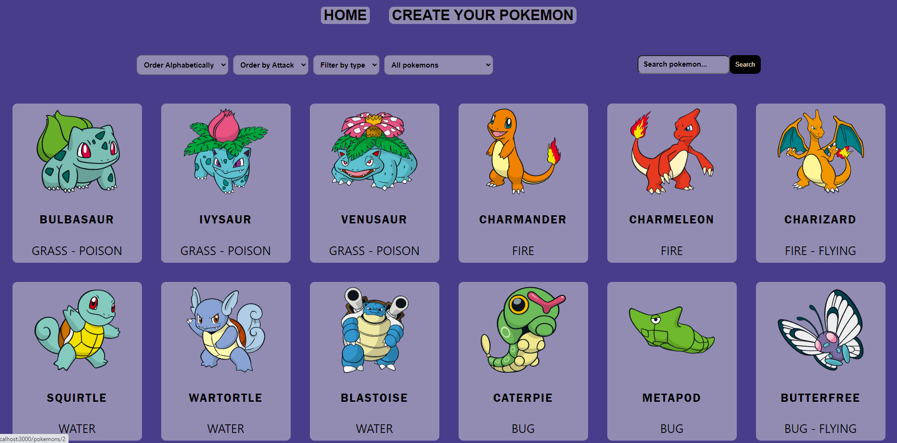

# PI-POKEMON-APP

Development and design of a SPA where we can observe different pokemons, see in detail what their relevant characteristics are, the information is consumed from an API.

The functionalities that the application has:

- Create a new pokemon
- Search pokemon by name
- Filter by type of pokemon and if the pokemon comes from the API or from the database
- Alphabetical ordering or by major attack

Technologies:

- For the database: PostgresSQL and Sequelize
- For the back-end: Nodejs with Express.
- For the front-end: React, Redux, Pure CSS
